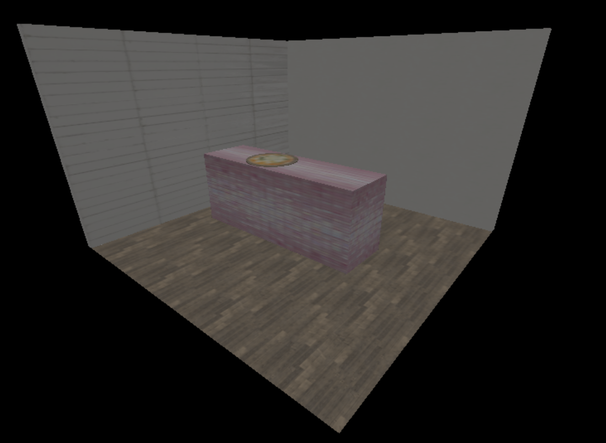
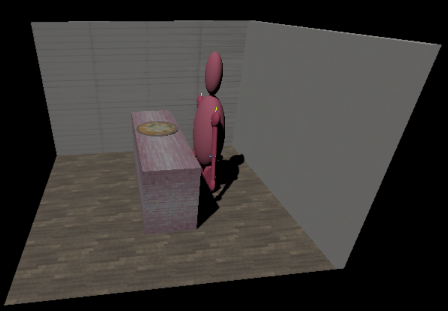
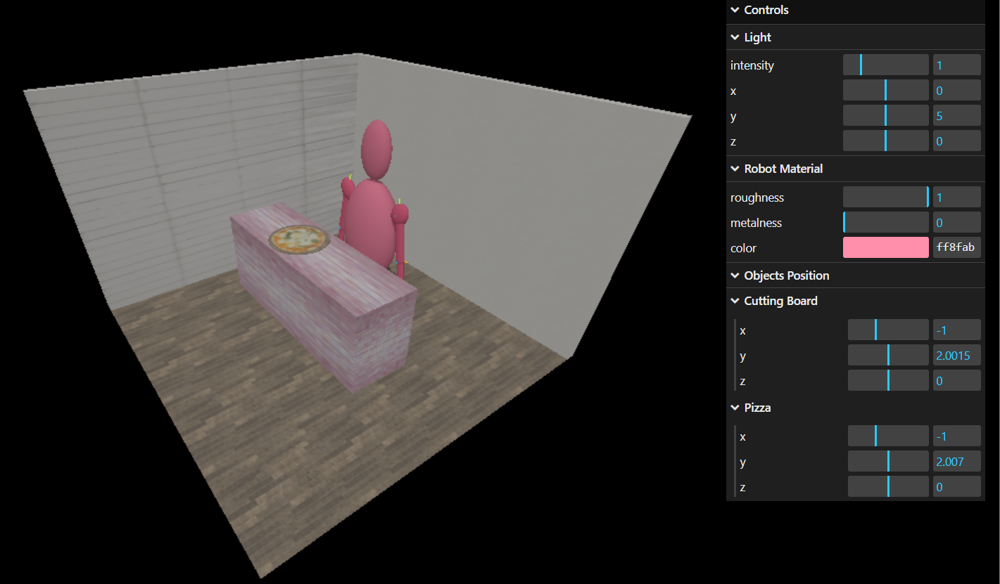
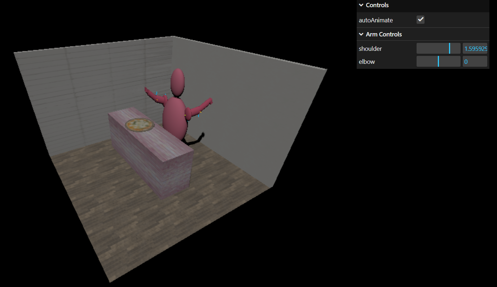
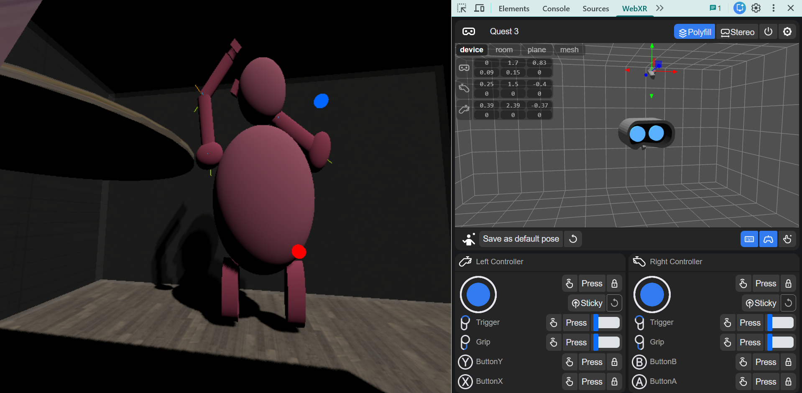

# Real Time 3D XR Visualization Project The Robot in the Kitchen

The goal of the project is to create a complete interactive Three.js scene containing a simplified kitchen environment and a humanoid robot. Across the exercises, the project develops from a static 3D scene into an animated and XR-ready tele-operation system where robot arm movement can be driven using VR controllers.

## Project Overview

The project is implemented using:

- **Three.js** for 3D rendering
- **WebGL** through the Three.js renderer
- **WebXR** for VR/AR interaction
- **OrbitControls** for desktop camera navigation
- **lil-gui** for debugging and interactive parameter control
- Custom modular JavaScript functions collected in `kitchen-utils.js`

## Repository Structure

```
Real-Time-3D-XR-Visualization-Project-The-Robot-In-The-Kitchen/
├── ex1_settingupthekitchenenvironment.html
├── ex2_thehumanoidrobot.html
├── ex3_lightingandshadows.html
├── ex4_animationandinteraction.html
├── ex5_teleoperationinVRMR.html
│
├── js/
│   └── kitchen-utils.js
│
├── assets/
│   └── wood_floor1.jpg
│   └── white_tiles.jpg
│   └── pink_tiles.jpg
│   └── wood.jpg
│   └── pizza.png
│   └── beige_wall.jpg
│
└── README.md
```
# Exercise 1 — Setting Up the Kitchen Environment

The first exercise creates the base kitchen scene.
The scene includes a perspective camera, a WebGL renderer, shadow support, and OrbitControls for viewing the environment.
I built the room with a textured floor and two walls, then added a kitchen counter using `BoxGeometry`. The floor, walls, and counter use different textures and `MeshStandardMaterial` to make the environment visually clear.
I also placed two objects on the counter: a wooden cutting board and a pizza with a PNG texture. These objects help prepare the scene for later interaction with the robot.

This exercise establishes the environment where the robot will later be placed.

## Example Result



# Exercise 2 — Humanoid Robot and Hierarchical Modeling

The second exercise adds a simplified humanoid robot.
The robot has an oval torso, a round head, two arms, and a wheeled base.
The main focus of this exercise was hierarchical modeling. I used `THREE.Group` objects as shoulder and elbow joints, so rotating a parent joint correctly moves all child parts of the arm.
Each arm includes a shoulder, upper arm, elbow, forearm, and hand. The arm parts are positioned so that the pivots are located at the joints, and I added `AxesHelper` objects to visualize the local axes during debugging.

## Example Result



# Exercise 3 — Lighting and Shadows

In this exercise, I improved the realism of the scene by adding ambient light, a spotlight above the kitchen counter, and shadow support. The spotlight simulates a ceiling lamp and casts shadows, while the ambient light prevents the scene from becoming too dark.
The shadow map size and shadow bias are adjusted to reduce artifacts, and I used `THREE.PCFSoftShadowMap` for softer shadows. The robot and objects cast shadows, while the floor and counter receive them.
All main materials use `MeshStandardMaterial`, so they react correctly to lighting. I also added `lil-gui` controls for the light, robot material, robot color, and object positions.

## Example Result



# Exercise 4 — Animation and Interaction

The fourth exercise animates the robot using forward kinematics.
The shoulder and elbow joints are animated with `Math.sin(Date.now())`, creating a smooth waving or chopping motion.
I used `OrbitControls` so the user can inspect the scene and robot hierarchy from different angles. I also added GUI controls to enable or disable the animation and manually adjust the shoulder and elbow angles for debugging.

This exercise demonstrates how parent-child transformations allow the arm to move naturally through joint rotations.

## Example Result



# Exercise 5 — Tele-operation in VR/MR

The final exercise adds WebXR support and controller-based tele-operation.
The renderer is configured for XR, and the scene includes both `VRButton` and `ARButton`.
I accessed two VR controllers using `renderer.xr.getController(0)` and `renderer.xr.getController(1)`, then used them to control the robot arms. The project includes a remote-control mode, where controller rotation drives the shoulder and elbow joints, and an inverse kinematics mode, where the controller position becomes the target for the robot hand.
The inverse kinematics system uses a simple two-link analytical solver based on the Law of Cosines. For mixed reality mode, the kitchen walls are made transparent while the counter remains solid, so the robot appears to work on a real table.

## Example Result



# VR / AR / MR Support

For VR testing, it is usually easier to test the VRButton first.
For MR/AR testing, use the ARButton; in this mode, the kitchen walls are transparent while the table remains solid.

The AR/MR mode depends on device and browser support. When using the emulator, passthrough behavior may not look exactly like it would on a real XR headset.

